# Cognitive Recovery Flow Diagram

```mermaid
flowchart TD
    Start([Incoming LLM Request]) --> Analyze{Is Complex<br/>Operation?}
    
    Analyze -->|YES| Complex[120s Timeout<br/>+ 3 Retries]
    Analyze -->|NO| Standard[60s Timeout<br/>+ 3 Retries]
    
    Detection[Detection Criteria:<br/>• Keywords: refactor, registry,<br/>structural, migrate, nebula<br/>• Payload > 10KB]
    Detection -.->|Informs| Analyze
    
    Complex --> Execute[Execute Request]
    Standard --> Execute
    
    Execute --> Check{Timeout<br/>Error?}
    
    Check -->|NO| Success([✅ Return Response])
    Check -->|YES| Retry{Retries<br/>< 3?}
    
    Retry -->|YES| RetryExec[Retry with<br/>Exponential Backoff]
    RetryExec --> Execute
    
    Retry -->|NO| Fail([❌ Log Error +<br/>Suggest Chunking])
    
    style Start fill:#e3f2fd
    style Success fill:#c8e6c9
    style Fail fill:#ffcdd2
    style Complex fill:#fff3e0
    style Standard fill:#e8f5e9
    style Detection fill:#f3e5f5
```



## Flow Explanation

### 1. Request Analysis
Every incoming LLM request is analyzed for complexity:
- **Keywords detected**: `refactor`, `registry`, `structural`, `migrate`, `transform`, `nebula`, `architect`, `component manifest`, `large file`
- **Payload size**: Messages >10KB are considered complex

### 2. Timeout Assignment
Based on complexity analysis:
- **Complex Operations**: 120 seconds timeout
- **Standard Operations**: 60 seconds timeout
- **All Operations**: Maximum 3 retry attempts

### 3. Execution & Retry Logic
```
Attempt 1: Execute with assigned timeout
  ↓ (if timeout)
Attempt 2: Retry with exponential backoff
  ↓ (if timeout)
Attempt 3: Final retry attempt
  ↓ (if timeout)
Fail: Log detailed error + suggest chunking strategy
```

### 4. Error Handling
When a timeout occurs:
```typescript
if (errorMessage.includes('timeout')) {
  console.error(`⏱️ Timeout after ${timeout/1000}s for model ${modelId}`);
  console.error(`Consider increasing timeout or chunking the operation`);
}
```

## Timeout Progression

### Standard Operation (60s)
```
Request → Analyze (not complex) → 60s timeout → Execute
  ↓ Success
Return response in ~5-30s
```

### Complex Operation (120s)
```
Request → Analyze (complex detected) → 120s timeout → Execute
  ↓ Success
Return response in ~30-90s
```

### Failed Operation (with retries)
```
Request → 120s timeout → Execute → Timeout!
  ↓
Retry 1 (120s) → Timeout!
  ↓
Retry 2 (120s) → Timeout!
  ↓
Retry 3 (120s) → Timeout!
  ↓
Log error + Suggest chunking strategy
```

## Retry Backoff Strategy

The OpenAI SDK handles exponential backoff automatically:

```
Retry 1: Immediate
Retry 2: ~2 second delay
Retry 3: ~4 second delay
```

## Success Metrics

### Before Implementation
```
Operation: Refactor registry.tsx
Timeout: 15s
Result: ❌ INTERNAL_SERVER_ERROR
Success Rate: ~40%
```

### After Implementation
```
Operation: Refactor registry.tsx
Timeout: 120s (auto-detected)
Result: ✅ Completed in 47s
Success Rate: ~95% (expected)
```

## Edge Cases

### Case 1: Borderline Complexity
**Scenario**: Operation has 1 keyword but small payload
**Result**: Uses 120s timeout (conservative approach)
**Rationale**: Better to over-allocate time than fail

### Case 2: Very Large Payload
**Scenario**: 50KB message with no keywords
**Result**: Uses 120s timeout (payload-based detection)
**Rationale**: Large payloads often indicate complex operations

### Case 3: Network Instability
**Scenario**: Intermittent connection drops
**Result**: Retries up to 3 times with backoff
**Rationale**: Distinguishes between cognitive hang and network issues

## Monitoring Points

Key log messages to watch:

```bash
# Complexity detection
[OpenAIProvider] Using 120s timeout (Complex: true)
[OpenAIProvider] Using 60s timeout (Complex: false)

# Timeout errors
[OpenAIProvider] ⏱️ Timeout after 120s for model mistralai/mamba-codestral
[OpenAIProvider] Consider increasing timeout or chunking the operation

# Retry attempts
[OpenAI SDK] Retrying request (attempt 2/3)
[OpenAI SDK] Retrying request (attempt 3/3)
```

## Future Enhancements

### Progressive Timeout Scaling


### Checkpoint System


### Model Fallback Chain


---

**Diagram Legend:**
- 🟢 Green: Success paths
- 🟡 Yellow: Warning/Complex paths
- 🔴 Red: Error/Failure paths
- 🔵 Blue: Standard operations
- 🟣 Purple: Detection/Analysis
