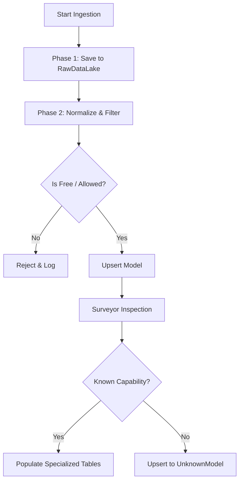

# Anti-Corruption Pipeline Implementation

## Overview

The Anti-Corruption Pipeline is a robust data ingestion system ensuring we never lose the source of truth when importing model data from external providers. It strictly separates **Storage (Phase 1)** from **Processing (Phase 2)**.

Recent enhancements (Jan 2026) include specific handling for **Unknown Models** and **Specialized Capabilities** (embeddings, audio, etc.).

## Architecture

### Phase 1: Raw Data Lake (The "Bag")
**Goal**: Save the file content EXACTLY as received. No filtering. No normalization.
- Reads JSON files from `latest_models/` directory or fetches via API.
- Stores raw JSON directly into `RawDataLake` table.
- **Zero data corruption risk**.

### Phase 2: The Gatekeeper (Application Layer)
**Goal**: Filter, normalize, and ingest into the `Model` table.
- Fetches raw records from `RawDataLake`.
- Applies filtering rules (whitelist/blacklist).
- Normalizes data into `Model` schema.
- **NEW**: Populates specialized tables (`EmbeddingModel`, `AudioModel`) based on capabilities.
- **NEW**: Segregates unidentified models into `UnknownModel` table for fallback availability.

## Filtering & Logic

### 1. Whitelist Approach (Fail-Open)
Models from these providers are automatically accepted (assumed free/safe):
- **Ollama**: Local models.
- **Groq, Mistral, Google**: Generous free tiers.

### 2. Strict Filtering (Fail-Closed)
**OpenRouter**:
- Must have exact zero pricing tokens (`prompt: 0`, `completion: 0`).
- Any model with >0 cost is **REJECTED** to prevent accidental charges.

### 3. Unknown Model Fallback
If a model is ingested but its capabilities cannot be determined by the `Surveyor` service:
- It is added to the `Model` table.
- A corresponding entry is created in `UnknownModel`.
- **Constraint**: `LLMSelector` can fallback to querying `UnknownModel` if no active specialized model matches a request, ensuring the system remains functional even with new, unrecognizable models.

## Data Schema

### Core Tables
- `RawDataLake`: Immutable history of provider responses.
- `Model`: The core entity used by the application.
- `ModelCapabilities`: 1:1 relation storing flags (`hasVision`, `hasReasoning`, `isMultimodal`).
- `ProviderConfig`: Stores API keys and base URLs.

### Specialized Tables
To support specific tasks, models are linked to specialized tables:
- `EmbeddingModel`: Stores `dimensions`, `maxContext`.
- `AudioModel`: Stores `voices`, `sampleRates`.
- `ImageModel`: Stores `resolutions`, `styles`.
- `SafetyModel`: Stores content safety categories.

**UnknownModel Table**:
- Links to `Model`.
- Stores `reason` (e.g., "uncategorized_by_surveyor").
- Used by `LLMSelector` as a "Hail Mary" fallback.

## Implementation Details

### Key Services
- **`UnifiedIngestionService.ts`**: Orchestrates the fetch -> raw -> normalize flow.
- **`RegistrySyncService.ts`**: Handles the sync logic, specialized table population, and `UnknownModel` upserts.
- **`Surveyor.ts`**: The "Model Doctor". Inspects model names/metadata to determine capabilities (`hasVision`, `primaryTask`).
- **`ProviderService.ts`**: Exposes `listAllAvailableModels`, now including `primaryTask` and `isMultimodal`.

### Execution Flow

## Troubleshooting

### "Models not appearing in App"
1. **Check Logs**: See if they were filtered out (e.g. Paid OpenRouter).
2. **Check Unknowns**: Look in `UnknownModel` table. They might be waiting for `Surveyor` logic updates.
3. **Check ProviderService**: Ensure `listAllAvailableModels` is returning them.

### "Fallback Logic"
If a specific capability (e.g. "Reasoning") is requested but no model has it:
- `LLMSelector` will try to find a generic model in `UnknownModel`.
- This prevents the "No model found" crash loop for new releases.
