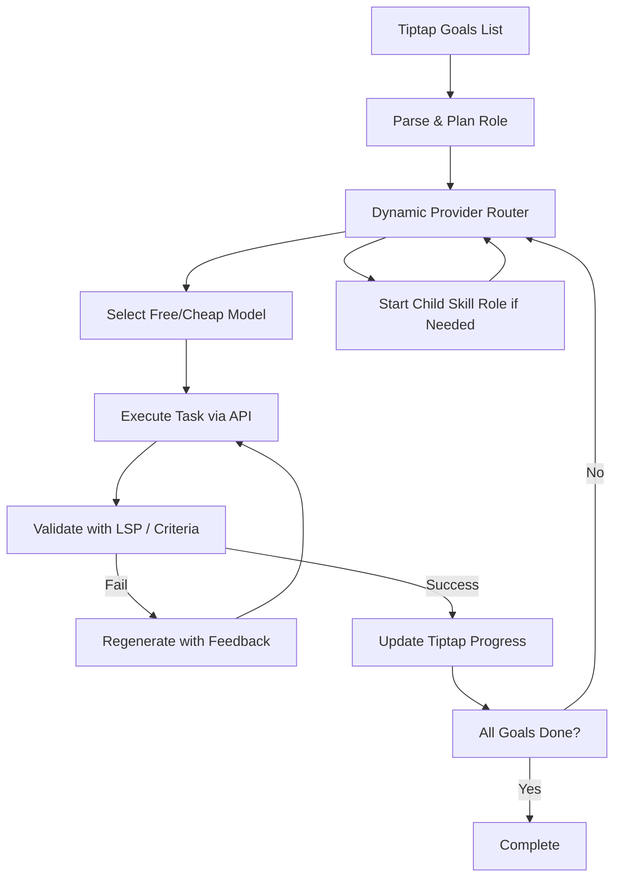

# Skill Integration Plan

## Existing Skills

### 1. coding-agent-orchestrator-1
- **Description**: Runs coding agents like Codex CLI, Claude Code, OpenCode, or Pi Coding Agent via background processes.
- **Key Features**:
  - Uses bash with PTY for interactive terminals.
  - Supports background mode for long-running tasks.
  - Process management: list, poll, log, write, submit, kill.
  - Specific commands for different agents (codex exec, claude, opencode run, pi).
  - Parallel execution using git worktrees for multiple issues.
- **Integration Points**:
  - Invoke via bash tool with pty:true and workdir.
  - Monitor and interact with sessions.
- **Challenges**:
  - Requires git repo for Codex.
  - PTY essential for interactive output.

### 2. skill-finder-installer
- **Description**: Discovers, retrieves, and installs Agent Skills using prompts.chat MCP server.
- **Key Features**:
  - Search skills by keyword, category, tag.
  - Get specific skill with all files.
  - Install by creating .claude/skills/{slug}/ directory and saving files.
- **Tools**:
  - search_skills(query, limit, category, tag)
  - get_skill(id)
- **Integration Points**:
  - Use for dynamic skill discovery and installation.
  - Roles can use this to add new skills autonomously.

## Overall Architecture (Refined for API AI Focus)

### Core Concept
- **Skill Servers as API Routers**: Treat skills as specialized roles that dynamically route tasks to free/cheap API providers to maximize "free labor".
- **Dynamic Model Routing**: Use provider selection logic to choose models based on cost, availability, and capability (e.g., prefer free tiers first).
- **No Local Agents**: Avoid local CLI agents; focus on API calls to multiple providers.

### Role Structure for Skill Integration
- **Skill Role Creation**: For each skill in skills/, create a Role that acts as a router.
  - Base prompt: "You are a [skill] specialist. Route tasks to the cheapest/free API model that can handle it. Use JSON tool calls."
  - Tools: Provider selector tool, multi-provider chat tool, cost estimator.
  - Variants: Free-only mode, cost-optimized mode, quality-first mode.
- **Task Assignment and Role Startup**:
  - Extend McpOrchestrator to 'startRole' which loads role prompt and tools, then routes to providers.
  - Roles assign subtasks by invoking child roles via orchestrator, passing provider preferences.
  - Job model tracks tasks with provider usage logs for cost tracking.

### Tool Calling Improvements for Cheap Models
- **JSON Challenges**: Cheap models may not support native JSON mode reliably.
  - Solution 1: Use models with confirmed JSON support (grok-fast, gpt-4o-mini).
  - Solution 2: Post-process output with regex/JSON repair libraries.
  - Solution 3: Multi-shot prompting: Ask for JSON, if invalid, re-prompt with "Fix this JSON: [output]".
- **Dynamic Routing Tool**: New tool 'selectProvider' that queries available models, filters by cost (free first), and routes the call.
  - Integrate with PricingRegistry for real-time cost checks.

### Language Server for Regeneration
- **LSP Integration**: Use typescript-language-server (or general LSP) for code tasks.
  - Tool: 'validateCode' that sends code to LSP for diagnostics.
  - Feedback Loop: If errors, append to prompt "Fix these errors: [LSP output]" and regenerate.
  - Limit loops to 3 attempts, then escalate to better model.

### Dynamic Skill and Tool Addition
- **Using Skill-Finder**: Create a 'SkillManager' role that uses the skill-finder-installer to search/install new skills.
  - Upon installation, parse SKILL.md to understand the skill.
  - Use code mode to generate TypeScript tool implementation compatible with the app's workflow (e.g., TRPC procedures or sandbox tools).
  - Feed generated TS to language server for validation and feedback until error-free.
  - Create new Role in DB with the generated tool, and add to Tool model if applicable.
  - Register any required MCP servers dynamically.
- **Compatibility with Workflow**: Skills are wrapped as TS tools/roles using code mode generation, ensuring seamless integration.
- **In-App Tools**: Roles can propose and generate new tools via code mode + LSP validation (e.g., embedding wrapper).
  - Autonomous: SkillManager identifies gaps from goals and implements/tests new tools using TypeScript generation loop.

### Autonomous Goal Achievement
- **Tiptap Integration**: Add endpoint to parse tiptap content for goals (e.g., bullet lists).
- **Planner Role**: Breaks goals into API-callable tasks, assigns to skill roles with provider constraints.
- **Execution & Self-Testing**:
  - Use cheap models for planning/parsing, route execution to free tiers.
  - Testing: For code goals, generate + validate with LSP; for other, use simple success criteria in prompts.
  - Loop until all goals checked off, update tiptap in real-time via websocket.

## Updated Diagram

## Dependencies
- Add ProviderSelector tool to routers.
- Extend Role with providerPreferences field.
- Integrate LSP client (e.g., vscode-languageserver).
- Websocket for tiptap updates.
- Cost tracking in ModelUsage for routing decisions.

## Next Steps
See todo list for detailed actions. Focus on API routing first.